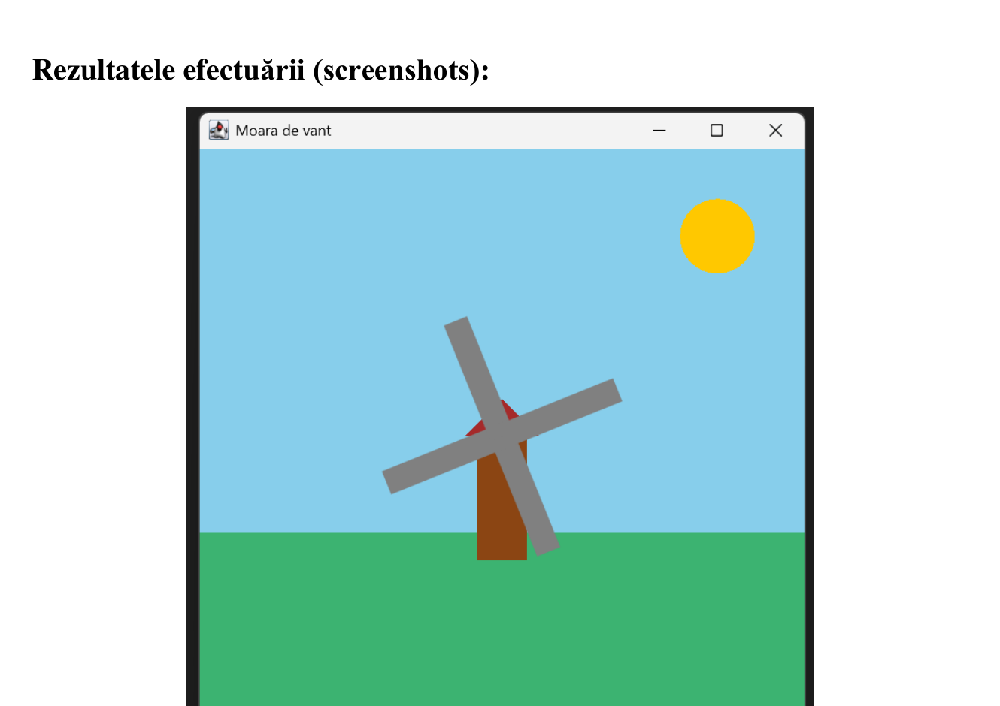
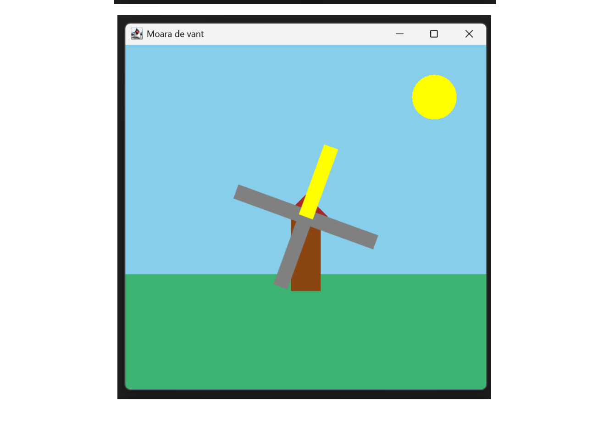
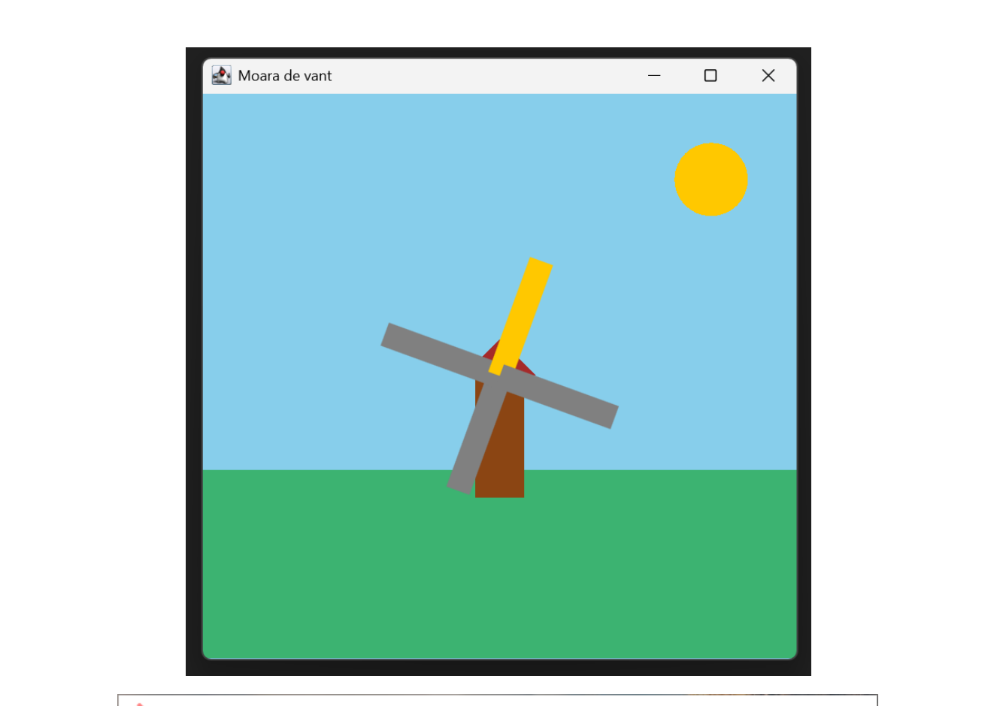

# 🌬️ Windmill — Java Swing Multi-Thread Animation

**Individual Assignment** · Concurrent and Distributed Programming · CR-221FR  
**Student:** Ciobanu Stanislav · **Supervisor:** Assist. Prof. Rotaru Lilia

---

## Description

Java Swing graphical application that animates a windmill using **three concurrent threads** that communicate via the `Exchanger<Color>` mechanism.  

The project demonstrates thread synchronization, angular event detection, and state propagation (color) between threads without explicit locking using `synchronized`.

Scene concept: windmill blades reflect sunlight when passing through the “12 o’clock” position. The reflection color is taken directly from the sun via `Exchanger` — the sun alternates between yellow and orange every 2 full rotations, simulating the transition from morning to daytime.

---

## Demo

### Blades in normal state (gray)



The blades rotate continuously. The sun is yellow. The blades have the default gray color.

---

### Active reflection — blade takes the sun’s color



When passing the “12 o’clock” position, the blade detected by the `reflection` thread initiates an `exchanger.exchange(null)` and receives the current sun color (yellow). The color is kept for 500ms, then the blade returns to gray.

---

### Reflection with yellow sun — different angle



Same mechanism, captured at a different rotation angle. Demonstrates that reflection works correctly for each sub-blade independently.

---

## Class Structure

```
Windmill (extends JPanel)
│
├── angle — current rotation angle (double)
├── blades = 2 — number of main blades
├── subBlades = 4 — blades * 2 (rendered segments)
├── exchanger — Exchanger<Color>
├── sunColor — volatile Color (YELLOW / ORANGE)
└── bladeColors[] — color of each sub-blade
│
├── Thread: rotation — rotation + sun color change
├── Thread: reflection — “12 o’clock” detection + exchange
└── Thread: exchangeThread — color provider
│
├── paintComponent() — Swing entry point
├── drawBackground() — sky, sun, grass, windmill body
└── drawWindmill() — hub + blades with AffineTransform
```

---

## Concepts Demonstrated

| Concept | Usage in Project |
|---|---|
| `Exchanger<T>` | Color exchange between reflection thread and sun thread |
| `volatile` | Guaranteed visibility of `angle` and `sunColor` across threads |
| Daemon threads | Threads automatically stop when the window is closed |
| `AffineTransform` | Independent rotation for each blade in Swing |
| `repaint()` | Asynchronous rendering from non-EDT threads |

---

> **Technical University of Moldova** · FCIM · Concurrent and Distributed Programming · 2025
